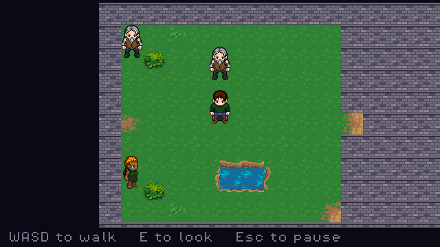
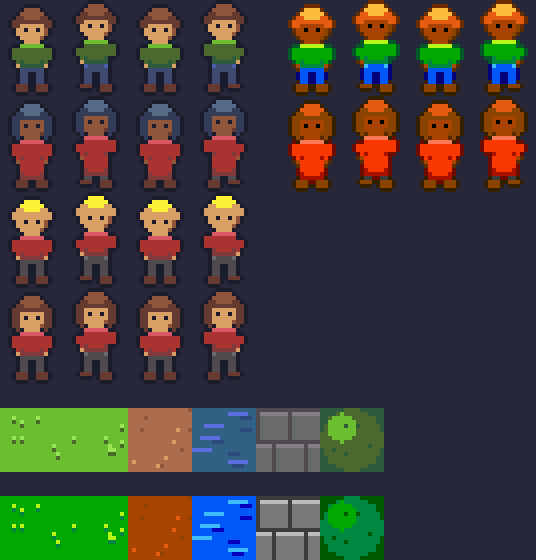
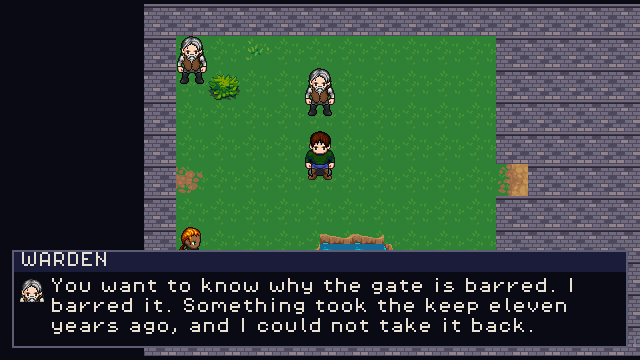
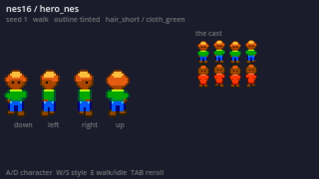

# 2D RPG Template

A reusable top-down RPG starting point for **Godot 4.7**, built so that *art style* and
*gameplay design* are the only things a new game has to change.

🎮 **[Play it](https://ali0600.github.io/rpg-template/)** — walk around, talk to the villagers,
find the key, open the gate.



It ships two halves:

1. **A consistent sprite generator** — a deterministic procedural paperdoll. Characters are
   composed from shared parts, one palette and one outline rule, so a whole cast is visually
   coherent *by construction* rather than by discipline. Same seed, same pixels, every run.
2. **The generic systems** — four-direction movement with tile collision, camera, data-driven
   maps with warps between them, NPCs and branching dialog, items you pick up and carry,
   game-flow states, a pause menu with per-game save slots, saves with migrations, a seeded
   RNG, procedurally generated sound effects, a headless QA harness, and CI that runs all
   of it.

## Why it looks the way it looks

Consistency in pixel art comes from rules, not talent: one limited palette, one outline style,
one size family, one set of proportions. A person applies those by discipline and drifts. The
generator applies them by construction and cannot — a rig part is an ASCII grid of tone
*indices*, and the style supplies what those indices mean, so there is no per-sprite place to
put a colour.

Those rules are then enforced as tests. Every generated pixel must be a palette colour; every
character's feet must sit on the same row; every left-facing frame must be its right-facing
frame mirrored; the same seed must produce the same bytes. Each gate ships with a mutant
proving it fails when broken.



*`gb16` and `nes16` share a rig — **not one pixel of shape is redrawn between them**. They
differ only in palette, outline treatment and timings. Swapping the style re-skins the cast,
the terrain and the interface together.*

The output tier is honest GB/SNES-era chibi, not hand-painted art. Higher fidelity is a
*source swap*, not a rewrite: `SpriteSource` is an interface, and anything that writes the
`PNG + <name>.sheet.json` pair — a bought pack, an AI generator — feeds the game unchanged.



## Quick start

```bash
/Applications/Godot.app/Contents/MacOS/Godot --path .
```

Run the full gate the way CI does:

```bash
tools/check.sh
```

Prove the gates actually bite (slower; run before calling a milestone done):

```bash
MUTANTS=1 tools/check.sh
```

Regenerate the art after editing a rig or a style:

```bash
/Applications/Godot.app/Contents/MacOS/Godot --headless --path . -s tools/gen_sprites.gd
```

## Making it your game

| To change | Edit | Touch any code? |
| --- | --- | --- |
| Which game runs, and where it starts | `data/games/*.tres` | no |
| The whole art style | a file in `data/styles/` | no |
| Who the characters are | files in `data/characters/` | no |
| The world | `data/maps/*.json` — ASCII rows plus a legend | no |
| What people say | `data/dialog/*.json` | no |
| How it feels to move, incl. free vs grid movement | `data/game_config.tres` | no |
| How many save slots there are | `data/game_config.tres` | no |
| What can be picked up and carried | `data/items/*.tres` | no |
| What a fight pays, and what the player starts with | `data/enemies/*.tres`, `data/games/*.tres` | no |
| What a shopkeeper sells, and for how much | `data/shops/*.tres`, `price` on `data/items/*.tres` | no |
| What can be worn, and what it is worth in a fight | `slot`/`attack`/`defense` on `data/items/*.tres` | no |
| New mechanics | a `GameHooks` subclass in `games/<id>/` | one file, never the template |
| New body parts | `data/rigs/*.json` | no |
| New terrain — a floor, a door, a cliff | `data/tiles/*.json` | no |

If changing any of these needs a code edit, that's a bug in the template.

A **game** is one `data/games/<id>.tres`: its first map and spawn, the character the player
wears, the tuning it uses, the line of on-screen help, and the one script it is allowed to
have. More than one can live side by side; with more than one and nothing choosing between
them the boot **refuses** rather than guessing, because a guessed game does not present as a
selection bug — it presents as the game you meant to run behaving strangely.

## The game it ships with

**The Barred Gate** — five maps on one palette. A town with a well, a smith and two people
with something to say, a cave east of it, a village up the north road, a hollow west of that,
and a keep behind a gate that stays shut until you find the key.

The warden barred that gate against the thing that took the keep. The key went into the
hollow, and what nests on it now is why nobody has fetched it.

| | |
| --- | --- |
| World | town, cave, village, hollow, keep — joined by five doors |
| Verbs | walk, talk, read a well, open a stash once, carry a key, unlock a gate with it, trade a word for a flask of oil, burn the oil lighting a lantern |
| Fights | four, three of them unavoidable: two slinks in the hollow, a gloom in the cave, and the Keeper standing between the keep's door and its lantern |
| Combat | menu turns with a timing window — a press on the cue doubles your hit or halves theirs. XP, three levels, and a tonic you can drink mid-fight |
| Code | **one file**: which of the warden's four lines to say |
| Look | `dusk16`, one of three palettes that share a single rig |

That one file is the point. Everything else — every map, every conversation, every flag, the
gate that wants a key and the lantern that drinks the oil — is data, and the template never
learns a word of it. A chest hands something over with `give_item`, a door reads what you are
carrying with `requires_item`, and a lantern consumes it with `take_item`; each of those is a
line of JSON, and none of them is code. The game was built
**without editing a single file under `scripts/`, `tools/` or `scenes/`**, and building it found
three real defects in the template, which is what building on it is for: a QA op that raced the
steps written after it, an art-drift gate that walked a different set of directories than the
game did, and three separate lists of "which directories does this project own" that disagreed.

Fighting is the same story: an enemy is four lines of JSON on a map, its numbers are a
`.tres` beside the items, and the difficulty is arithmetic rather than feel — a player who
times every press beats the Keeper on every seed, and one who times none of them loses on
every seed. Both are proven by a play script rather than asserted in a comment. Lose and the
run ends; the only ways on are a save or a fresh start, which is what makes saving matter.

Escape pauses, and the same menu saves and loads. Slots belong to the game that wrote them —
`user://saves/<game>/slot_N.json` — and each save names its own game, so a file that ends up in
the wrong directory is refused and preserved rather than loaded.

## Sprite Lab

A live preview of the generator — all four directions and the whole cast, laid out at the
game's own 320×180 so the art is judged at the size it will actually be seen.



## Layout

| Path | What lives there |
| --- | --- |
| `scripts/spritegen/` | The generator. Pure, deterministic, no node access. |
| `scripts/world/` | Movement, collision, maps, camera, interaction. |
| `scripts/ui/` | Dialog runner and its view, the pause menu, Sprite Lab. |
| `scripts/autoload/` | EventBus, Registry, GameState, SaveManager, Router, AudioBus, Qa. |
| `data/` | All content: games, styles, rigs, characters, maps, dialog, config. |
| `games/<id>/` | A game's own code, if it has any. |
| `assets/generated/` | Build output of `tools/gen_sprites.gd` — never hand-edited. |
| `tools/` | Headless scripts and the gate. |
| `tests/` | gdUnit4 suites, fixtures, and the mutation harness's targets. |

- [CLAUDE.md](CLAUDE.md) — the engineering contract
- [docs/ARCHITECTURE.md](docs/ARCHITECTURE.md) — the seams, and what each one protects
- [docs/STYLE_GUIDE.md](docs/STYLE_GUIDE.md) — the art rules, and how to change the look
- [docs/DECISIONS.md](docs/DECISIONS.md) — design forks, with a backlog of what's worth trying
- [docs/GENRE_CONVENTIONS.md](docs/GENRE_CONVENTIONS.md) — what 2D JRPGs converge on, and where this template sits against it
- [docs/learnings.md](docs/learnings.md) — the bugs that were interesting

## Milestones

- [x] **M0** — project skeleton, headless tooling, lint rules, mutation harness, CI
- [x] **M1** — the sprite generator, its consistency gates, and generated assets
- [x] **M2** — the sprite view scene and Sprite Lab preview
- [x] **M3** — movement, collision, camera, data maps, game-flow states, QA harness
- [x] **M4** — NPCs, interaction, branching dialog
- [x] **M5** — saves with migrations, audio seam, content registry
- [x] **M6** — web export and a live demo
- [x] **M7** — a second game, built to find out whether the first six were true
- [x] **M8** — a game picker, so switching is a keypress rather than an edit *(retired in M11)*
- [x] **M9** — grid-step movement as a second mode, off by default
- [x] **M10** — a pause menu, and save slots that belong to one game
- [x] **M11** — one game, one world, and the name this repo should have had
- [x] **M12** — items and an inventory, and a quest that runs on them
- [x] **M13** — turn-based battles with timed presses, XP and levels, and a quest reworked around them
- [x] **M13.1–.4** — the play-test round: reaction-sized timing windows, a quest that says where to go, a dialog box that declares its capacity, a quiet build log
- [x] **M14** — sound: a synthesiser driven by a cue bank and a voice, generated and drift-gated the way the sprites are, with the whole game finally audible
- [x] **M14.1** — the gate got 17x faster without losing an assertion: frame-driven runs stop waiting on the wall clock, and a pull request proves the mutants its own diff could have broken
- [x] **M15** — the gate finally looks at what ships: the exported .pck is booted and played on every run, and the played game now notices its own combat arithmetic
- [x] **M16** — terrain became data: tiles are authored pixel art in `data/tiles/*.json` in the rig's own alphabet, the six procedural ones ported losslessly, and a floor, a rough wall, a door, steps, a table and a rug added without touching a script
- [x] **M17** — NPCs move: `behavior` on a map record is `static`, `wander` or `patrol`, driven through the same Locomotion the player uses, and the whole town freezes with the player so nobody wanders off mid-sentence
- [x] **M18** — money: gold that a fight drops and a save carries, and a shopkeeper opened from a dialog choice who refuses what you cannot afford and will not touch a quest item
- [x] **M18.1** — the shop became a counter: an item list with a price column, a purse, a description bar, a keeper who talks, and a "how many?" step, all in windows over the world you are standing in
- [x] **M19** — equipment: a weapon and an armour slot whose stats reach the fight as modifiers, worn from the bag with an (E) marker and a stat preview, and refused by the shop counter while you are wearing it
- [x] **M20** — equipment became a screen: a menu command of its own opening a slot list, each slot offering the gear that fits it plus a way to take it off, with the swap previewed against what you are already wearing — and `docs/GENRE_CONVENTIONS.md`, which is what the genre research now lands in, plus a Status page — level, HP, how far to the next level, and what you are wearing, none of which could be seen outside a fight before
- [x] **M21** — an inn: the first interior you walk into, a keeper who names a price out loud and refuses in words, a night that fades, and the loop the economy rests on — fight, lose hit points, pay to get them back
- [x] **M22** — a title screen: the game's own name, Continue and New game, and a game-over screen that finally routes back to it

## Experience Gained

- Designed a deterministic, seed-driven asset generation pipeline producing game-ready sprite
  sheets plus machine-readable metadata, with reproducibility enforced by golden-hash
  regression tests in CI.
- Built a multi-stage verification gate (static lint, isolated parse, whole-project compile,
  unit suites, runtime boot check, generated-artifact drift detection, and scripted
  end-to-end play) that fails closed, hardened against four known false-green modes: a piped
  exit code, a test runner that exits 0 having run nothing, a scan that visited no files, and
  a build artifact that no longer matches its source.
- Implemented mutation testing over the project's own quality gates, so each rule ships with
  machine-verified proof that it detects the defect it was written for; a rule whose mutant
  stops applying fails the build rather than quietly reducing coverage. Three tests were
  identified as decorative this way and rewritten to assert the mechanism.
- Authored CI/CD pipelines in GitHub Actions with SHA-pinned third-party actions,
  least-privilege token scopes, and checksum-verified toolchain downloads, avoiding
  third-party installer actions in the supply chain; the deployment job is gated on the test
  workflow's conclusion and pinned to the exact commit that passed rather than racing it.
- Built a scripted integration-test harness that drives the real application end to end
  (input, physics, state transitions) headlessly, used as both a local developer gate and a
  CI check.
- Architected a swappable-asset-source seam (interface plus a PNG/JSON contract) decoupling
  the runtime from how art is produced, enabling procedural, hand-authored or AI-generated
  assets behind one API.
- Implemented versioned save serialization with a forward-migration chain and fail-safe
  corruption handling that preserves the original bytes before any recovery path runs.
- Designed a deterministic, frame-quantised turn-based combat system whose entire rule set is
  a dependency-free unit under test: time is injected one simulation tick at a time rather
  than read from a clock, making every fight reproducible from a seed and drivable by
  automated play scripts on an exact frame.
- Specified game balance as executable assertions rather than designer intuition, proving from
  the shipped data that optimal play wins on every random seed and unskilled play loses on
  every seed — so a retuned stat fails the build with the reason, instead of silently making a
  skill mechanic decorative.
- Extended automated end-to-end coverage to both ends of the competence range after
  identifying that a competent test driver only exercises the branches competent play reaches;
  the deliberately-unskilled driver covers the failure, retreat and recovery paths a passing
  run never visits.
- Added a static pre-flight check to the mutation-testing pipeline after diagnosing that newly
  added code can silently re-target an existing, untouched mutation onto the wrong function;
  the check runs unconditionally in seconds where the full suite takes twenty minutes, moving
  detection from post-push CI to pre-commit.

---

🔗 **Live:** https://ali0600.github.io/rpg-template/ · **Repo:** https://github.com/Ali0600/rpg-template
