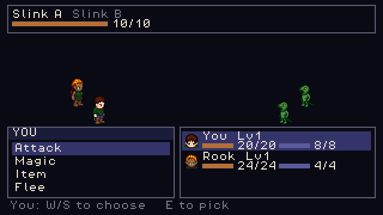

# 2D RPG Template

A reusable top-down RPG starting point for **Godot 4.7**, built so that *art* and *game
design* are the only things a new game has to change. The game it ships with is six maps,
twelve hand-drawn characters, branching dialog, a quest, party-based turn-based combat, shops,
equipment and saves — and exactly one file of its own code.

🎮 **[Play it](https://ali0600.github.io/rpg-template/)** — walk around, talk to the villagers,
find the key, open the gate.


## What it is

**The systems.** Four-direction movement with tile collision (free or grid-stepped), a camera,
data-driven maps with warps, NPCs that stand, wander or patrol, branching dialog with
conditions and effects, items you carry and doors that read them, a party that grows through
conversation, turn-based fights with a timing window, magic and statuses, shops, an inn,
equipment, gold, music and sound, save slots with migrations, a title screen, and a state
machine declared as data. All of it seeded, so the same inputs give the same game every time.

**The art seam.** The runtime reads one contract — a PNG and a `<name>.sheet.json` beside it —
and does not care who drew it. Two things feed it today. A procedural rig draws a whole cast
from ASCII part grids and a palette, so a style swap re-skins characters, terrain and interface
together; three such styles ship (`gb16`, `nes16`, `dusk16`). And a build-time importer takes
hand-drawn art from the [Universal LPC Spritesheet Character
Generator](https://github.com/LiberatedPixelCup/Universal-LPC-Spritesheet-Character-Generator)
and the LPC tile sets, checks every layer's licence by name, writes the credits beside the
sprites, and composes the shorelines and verges where two grounds meet. Both arms are
regenerated in CI and the build fails if the committed pixels differ.

**The gate.** Every rule the template makes is a test, and every test ships with a mutant
proving it fails when the rule is broken. `tools/check.sh` runs lint, parse, compile, 1,325
tests, a boot check, artifact drift, 23 scripted play sessions and the exported package, in
that order, locally and in CI.

## The game it ships with

**The Barred Gate.** A village with a pond, a town with a smith and an inn, a cave east of it, a
hollow up the north road, and a keep behind a gate that stays shut until you find the key. The
warden barred that gate against the thing that took the keep. The key went into the hollow,
and what nests on it now is why nobody has fetched it.



| | |
| --- | --- |
| World | six maps joined by doors, drawn in hand-made LPC art at 32px tiles |
| Verbs | walk, talk, read a well, open a stash once, carry a key, unlock a gate with it, trade a word for a flask of oil, burn the oil lighting a lantern, sleep at an inn, buy and sell, wear a sword |
| Fights | five, every one a crowd: paired slinks, paired glooms, a slink-and-gloom pair, and the Keeper with an escort. Three are unavoidable, and both roads out of the village stay shut until Rook is along — a fight sized for two must not be reachable by one |
| Combat | menu turns with a timing window — press on the cue and your hit doubles or theirs halves. Up to three a side, a cursor to pick which foe, five spells on a level curve, a ward and a chill, XP and levels |
| Code | **one file**, 96 lines: which of the warden's four lines to say |

That one file is the point. Every map, conversation, flag, price, spell and fight is data, and
the template never learns a word of it. A chest hands something over with `give_item`, a door
reads what you carry with `requires_item`, a lantern consumes it with `take_item` — each a line
of JSON. The game was built **without editing a single file under `scripts/`, `tools/` or
`scenes/`**.


Difficulty is arithmetic rather than feel: a player who times every press beats the Keeper on
every seed, and one who times none of them loses on every seed. Both are proven by a play
script that drives the real engine, not asserted in a comment.

## Quick start

```bash
/Applications/Godot.app/Contents/MacOS/Godot --path .
```

Run the full gate the way CI does, and then prove the gates bite (slower):

```bash
tools/check.sh
MUTANTS=1 tools/check.sh
```

Regenerate the art after editing a rig, a style, a tile bank or an import:

```bash
/Applications/Godot.app/Contents/MacOS/Godot --headless --path . -s tools/gen_sprites.gd
```

Draw a map in [Tiled](https://www.mapeditor.org/) instead of typing it — export, edit, import.
The maps that ship stay readable ASCII, so a map still diffs as a picture in a pull request;
LDtk works the same way (`--out=ldtk`):

```bash
tools/map_io.sh --out=tiled --dir=build/map
tools/map_io.sh --in=build/map/quest_village.tmj
```

Bring in a hand-drawn character as a text recipe naming the generator's layers and colours —
`tools/lpc_compose.sh` fetches only the layers it needs and composes the same two files the
browser would download — or drop the generator's own **Download PNG** and **Export JSON** into
`data/imports/lpc32/<character>/`. Terrain comes in the same way, a file and a cell per tile:

```bash
tools/lpc_compose.sh docs/lpc_designs/the_road.json --out=data/imports/lpc32/quest_wanderer
tools/fetch_tiles.sh data/tiles/lpc32.json
```

The recipes are in [`data/imports/lpc32/README.md`](data/imports/lpc32/README.md) and
[`data/imports/tiles/README.md`](data/imports/tiles/README.md).

## Making it your game

| To change | Edit | Touch any code? |
| --- | --- | --- |
| Which game runs, and where it starts | `data/games/*.tres` | no |
| The whole art style | a file in `data/styles/` | no |
| Who the characters are | files in `data/characters/`, or a recipe in `docs/lpc_designs/` | no |
| The world | `data/maps/*.json` — ASCII rows plus a legend, or draw it in Tiled and import | no |
| What people say | `data/dialog/*.json` | no |
| How it feels to move, free or grid; where a game may be saved | `data/game_config.tres` | no |
| What can be picked up, worn, sold, and for how much | `data/items/*.tres`, `data/shops/*.tres` | no |
| What a fight pays, what a spell does, what resists it | `data/enemies/*.tres`, `data/spells/*.tres` | no |
| New terrain, and the edges where two grounds meet | `data/tiles/*.json` | no |
| Music and sound | `data/music/*.json`, `data/banks/*.json`, a voice in `data/sounds/` | no |
| New mechanics | a `GameHooks` subclass in `games/<id>/` | one file, never the template |

If changing any of these needs a code edit, that's a bug in the template.

A **game** is one `data/games/<id>.tres`: its first map and spawn, the character the player
wears, the tuning it uses, and the one script it is allowed to have. More than one can live side
by side; with more than one and nothing choosing between them the boot **refuses** rather than
guessing, because a guessed game presents as the game you meant to run behaving strangely.

## Layout

| Path | What lives there |
| --- | --- |
| `scripts/spritegen/` | The generator, the importer and the terrain composer. Pure, deterministic, no node access. |
| `scripts/world/` | Movement, collision, maps, camera, interaction. |
| `scripts/ui/` | Dialog, pause menu, battle, shop, inn, title, and Sprite Lab — a live preview of any style at the game's own size. |
| `scripts/autoload/` | EventBus, Registry, GameState, SaveManager, Router, AudioBus, Settings, Qa. |
| `scripts/util/` | Build-time readers, `Dir`, `Sfx`, `UiScale`, the Tiled and LDtk translators. |
| `data/` | All content. `data/imports/` holds the hand-drawn inputs, never packed. |
| `games/<id>/` | A game's own code, if it has any. |
| `assets/generated/` | Build output of `tools/gen_sprites.gd` and `gen_sounds.gd` — never hand-edited. |
| `tools/` | Headless scripts and the gate. |
| `tests/` | 89 gdUnit4 suites, fixtures, 23 play sessions, and the mutation harness's targets. |

- [CLAUDE.md](CLAUDE.md) — the engineering contract
- [docs/ARCHITECTURE.md](docs/ARCHITECTURE.md) — the seams, and what each one protects
- [docs/STYLE_GUIDE.md](docs/STYLE_GUIDE.md) — the art rules, and how to change the look
- [docs/GENRE_CONVENTIONS.md](docs/GENRE_CONVENTIONS.md) — what 2D JRPGs converge on, and where this template sits against it
- [docs/DECISIONS.md](docs/DECISIONS.md) — design forks, with a backlog of what's worth trying
- [docs/MILESTONES.md](docs/MILESTONES.md) — every milestone shipped, one line each
- [docs/learnings.md](docs/learnings.md) — the bugs that were interesting

## Experience Gained

- Built a reusable 2D RPG template in Godot 4 / GDScript in which a complete game — six maps,
  branching dialog, a quest, party-based turn-based combat, shops, equipment and versioned
  saves — is data plus one 96-line hooks file, with every gameplay system swappable behind a
  single seam.
- Designed a deterministic asset pipeline: procedural sprite generation from ASCII rigs and
  palettes, a build-time importer for hand-drawn art with per-file licence gating and generated
  attribution, and sub-tile autotiling that composes 47 edge shapes from 12 pieces — all in
  integer arithmetic so output is byte-identical on macOS and Linux, and drift-gated in CI.
- Engineered a fail-closed CI/CD pipeline in GitHub Actions: lint → parse → compile → 1,325
  unit and integration tests → boot → artifact drift → 23 scripted end-to-end play sessions →
  the exported package played; SHA-pinned actions, least-privilege tokens, a checksum-verified
  toolchain, and a Pages deploy gated on the green run of the exact commit it ships.
- Implemented mutation testing over the project's own quality gates — 629 mutants, each proving
  a rule fails when broken — sharded four ways with a change-scoped fast lane (pull-request runs
  18 → 3 min) and a sub-second static check that every mutant still targets one line.
- Built model-based testing of the application's state machine: transitions declared as data
  and driven through the real game, seeded random walks over one live world, and automatic
  counterexample shrinking (a 24-step failure reduced to 5). Extended it to rendered layout —
  automated audits of every screen's geometry that caught defects six years of passing tests
  could not see, including readouts drawn over the sprites they described.
- Replaced closed-form game-balance rules with deterministic simulation: the real combat engine
  played to completion under opposed policies across many seeds, asserting from shipped data
  that skilled play always wins and unskilled play always loses.
- Grounded design decisions in primary sources — shipped-binary disassemblies and editor loader
  source where documentation was missing or wrong — and recorded each with its evidence tier.

---

🔗 **Live:** https://ali0600.github.io/rpg-template/ · **Repo:** https://github.com/Ali0600/rpg-template
