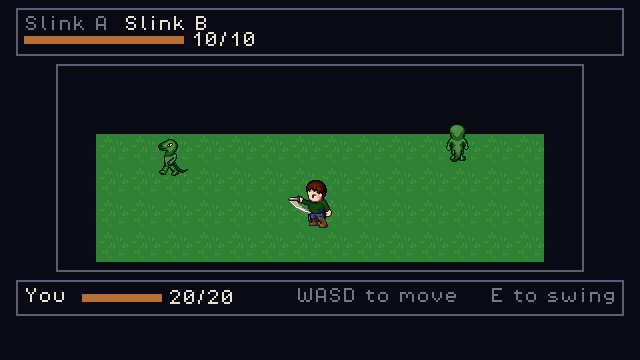

# 2D RPG Template

A reusable top-down RPG starting point for **Godot 4.7**. It is built so that a new game only
has to change two things: *art* and *game design*. The game it ships with has six maps, twelve
hand-drawn characters, branching dialog, a quest, party-based turn-based combat, shops,
equipment and saves. It has exactly one file of its own code.

🎮 **[Play it](https://ali0600.github.io/rpg-template/)** — walk around, talk to the villagers,
find the key, open the gate.


## What it is

**The systems.** The template ships with: four-direction movement with tile collision (free, or
one tile per step), a camera, maps written as data with warps between them, NPCs that stand,
wander or patrol, branching dialog with conditions and effects, items you carry and doors that
check for them, a party that grows through conversation, turn-based fights with a timing
window, magic and status effects, shops, an inn, equipment, gold, music and sound, save slots
with migrations (so older saves still load), a title screen, and a state machine declared as
data. Everything is seeded, so the same inputs give the same game every time.

**The art seam.** The game reads art in one format: a PNG and a `<name>.sheet.json` file
beside it. It does not care who drew it. Two things feed it today. The first is a procedural
rig. It draws a whole cast from ASCII part grids and a palette, so swapping the style re-skins
the characters, terrain and interface together. Three such styles ship (`gb16`, `nes16`,
`dusk16`). The second is a build-time importer. It takes hand-drawn art from the
[Universal LPC Spritesheet Character Generator](https://github.com/LiberatedPixelCup/Universal-LPC-Spritesheet-Character-Generator)
and the LPC tile sets, checks every layer's licence by name, writes the credits beside the
sprites, and draws the shorelines and verges where two kinds of ground meet. CI regenerates
both, and the build fails if the committed pixels differ.

**The gate.** Every rule the template makes is a test. Every test ships with a mutant — a
deliberate break in the code — that proves the test fails when the rule is broken.
`tools/check.sh` runs lint, parse, compile, 1,693 tests, a boot check, an artifact drift check
(generated files must match what is committed), 30 scripted play sessions and the exported
package, in that order. It runs the same way locally and in CI.

## The game it ships with

**The Barred Gate.** A village with a pond. A town with a smith and an inn. A cave east of the
town, a hollow up the north road, and a keep behind a gate that stays shut until you find the
key. The warden barred that gate against the thing that took the keep. The key went into the
hollow. What nests on it now is why nobody has fetched it.


| | |
| --- | --- |
| World | six maps joined by doors, drawn in hand-made LPC art at 32px tiles |
| Verbs | walk, talk, read a well, open a stash once, carry a key, unlock a gate with it, trade a word for a flask of oil, burn the oil lighting a lantern, sleep at an inn, buy and sell, wear a sword |
| Fights | five, and every one is a crowd: paired slinks, paired glooms, a slink-and-gloom pair, and the Keeper with an escort. Three cannot be avoided. Both roads out of the village stay shut until Rook joins you — a fight sized for two must not be reachable by one |
| Combat | menu turns with a timing window — press on the cue and your hit doubles or theirs halves. Up to three a side, a cursor to pick which foe, five spells that unlock as you level up, a ward and a chill, XP and levels. Or turn **Fights** to Sword on the Options page, at the title or mid-run: the same encounters, awards and levels, fought in real time with a sword |
| Code | **one file**, 96 lines: which of the warden's four lines to say |

That one file is the point. Every map, conversation, flag, price, spell and fight is data. The
template never learns a word of it. A chest hands something over with `give_item`. A door
checks what you carry with `requires_item`. A lantern uses it up with `take_item`. Each is one
line of JSON. The game was built **without editing a single file under `scripts/`, `tools/` or
`scenes/`**.


Difficulty is arithmetic, not feel. A player who times every press beats the Keeper on every
seed. A player who times none of them loses on every seed. A play script that drives the real
engine proves both. No comment just claims it. With the sword, a player who uses its reach beats
the Keeper on every seed too, and one who walks straight into him wins 4 times in 48.



## Quick start

Start your own game. This writes a manifest, a first room with somebody standing in it, and a
scripted play session that proves the whole thing boots. Then it tells you the one line to add
to `project.godot` so the engine knows which game to run:

```bash
tools/new_game.sh --id=my_game
```

Play the game that ships:

```bash
/Applications/Godot.app/Contents/MacOS/Godot --path .
```

Run the full gate the way CI does. Then prove the gates really catch broken rules (slower):

```bash
tools/check.sh
MUTANTS=1 tools/check.sh
```

Regenerate the art after editing a rig, a style, a tile bank or an import:

```bash
/Applications/Godot.app/Contents/MacOS/Godot --headless --path . -s tools/gen_sprites.gd
```

Draw a map in [Tiled](https://www.mapeditor.org/) instead of typing it: export, edit, import.
The maps that ship stay as readable ASCII, so a map still shows up as a picture in a pull
request diff. LDtk works the same way (`--out=ldtk`):

```bash
tools/map_io.sh --out=tiled --dir=build/map
tools/map_io.sh --in=build/map/quest_village.tmj
```

Ponds and paths open in the editor with the same shorelines the game draws, and Tiled gets a
terrain brush for each one. Paint the ground around the water, not the water itself, and the
edge shapes itself. (The brush and the game draw edges from opposite sides, so painting the water
can't come out right.)

Bring in a hand-drawn character in one of two ways. Write a text recipe that names the
generator's layers and colours; `tools/lpc_compose.sh` fetches only the layers it needs and
builds the same two files the browser would download. Or drop the generator's own
**Download PNG** and **Export JSON** into `data/imports/lpc32/<character>/`. Terrain comes in
the same way, with a file and a cell per tile:

```bash
tools/lpc_compose.sh docs/lpc_designs/the_road.json --out=data/imports/lpc32/quest_wanderer
tools/fetch_tiles.sh data/tiles/lpc32.json
```

The recipes are in [`data/imports/lpc32/README.md`](data/imports/lpc32/README.md) and
[`data/imports/tiles/README.md`](data/imports/tiles/README.md).

## Making it your game

| To change | Edit | Touch any code? |
| --- | --- | --- |
| Which game runs, and where it starts | `data/games/*.tres` | no |
| The whole art style | a file in `data/styles/` | no |
| Who the characters are | files in `data/characters/`, or a recipe in `docs/lpc_designs/` | no |
| The world | `data/maps/*.json` — ASCII rows plus a legend, or draw it in Tiled and import | no |
| What people say | `data/dialog/*.json` | no |
| How it feels to move, free or grid; where a game may be saved | `data/game_config.tres` | no |
| What can be picked up, worn, sold, and for how much | `data/items/*.tres`, `data/shops/*.tres` | no |
| What a fight pays, what a spell does, what resists it | `data/enemies/*.tres`, `data/spells/*.tres` | no |
| New terrain, and the edges where two grounds meet | `data/tiles/*.json` | no |
| Music and sound | `data/music/*.json`, `data/banks/*.json`, a voice in `data/sounds/` | no |
| New mechanics | a `GameHooks` subclass in `games/<id>/` | one file, never the template |

If changing any of these needs a code edit, that's a bug in the template.

`tools/new_game.sh --id=<name>` writes the first four of those rows for a new game. You then
edit content, not wiring. `--style=` picks the art. `--movement=grid` makes one press move one
tile. `--save=at_point` moves saving to a save point. `--combat=turns` adds fighting. `--hooks`
gives the game a file of its own code. A game that sets none of those shares the template's
tuning on purpose. If a game differs for no reason its design asked for, every difference a
player feels becomes a suspected bug.

A **game** is one `data/games/<id>.tres` file. It names the first map and spawn point, the
character the player plays as, the tuning it uses, and the one script it is allowed to have.
More than one game can live side by side. If there is more than one and nothing picks between
them, the boot **refuses** to guess. A guessed game would look like the game you meant to run
behaving strangely.

## Layout

| Path | What lives there |
| --- | --- |
| `scripts/spritegen/` | The generator, the importer and the terrain composer. Pure functions with the same output every time, and no node access. |
| `scripts/world/` | Movement, collision, maps, camera, interaction. |
| `scripts/ui/` | Dialog, pause menu, battle, shop, inn, title, and Sprite Lab — a live preview of any style at the game's own size. |
| `scripts/autoload/` | EventBus, Registry, GameState, SaveManager, Router, AudioBus, Settings, Qa. |
| `scripts/util/` | Build-time readers, `Dir`, `Sfx`, `UiScale`, the Tiled and LDtk translators. |
| `data/` | All content. `data/imports/` holds the hand-drawn inputs; they are never packed into the build. |
| `games/<id>/` | A game's own code, if it has any. |
| `assets/generated/` | Build output of `tools/gen_sprites.gd` and `gen_sounds.gd`. Never edit it by hand. |
| `tools/` | Headless scripts and the gate. |
| `tests/` | 109 test suites for gdUnit4 (a Godot test framework), fixtures, 30 play sessions, and the targets the mutation harness aims at. |

- [CLAUDE.md](CLAUDE.md) — the engineering contract
- [docs/ARCHITECTURE.md](docs/ARCHITECTURE.md) — the seams, and what each one protects
- [docs/STYLE_GUIDE.md](docs/STYLE_GUIDE.md) — the art rules, and how to change the look
- [docs/GENRE_CONVENTIONS.md](docs/GENRE_CONVENTIONS.md) — what 2D JRPGs converge on, and where this template sits against it
- [docs/DECISIONS.md](docs/DECISIONS.md) — design forks, with a backlog of what's worth trying
- [docs/MILESTONES.md](docs/MILESTONES.md) — every milestone shipped, one line each
- [docs/learnings.md](docs/learnings.md) — the bugs that were interesting

## Experience Gained

- Built a reusable 2D RPG template in Godot 4 / GDScript. A complete game — six maps, branching
  dialog, a quest, two interchangeable combat systems (party turn-based battles, and a real-time
  sword arena a player switches to from the Options menu), shops, equipment and versioned saves — is data
  plus one 96-line hooks file. One command with one flag generates a new game. An automated gate
  boots that generated game and walks its player, so every CI run re-proves that the template is
  reusable, rather than just claiming it.
- Designed an asset pipeline with the same output every time: procedural sprites drawn from
  ASCII rigs and palettes; a build-time importer for hand-drawn art that checks every layer's
  licence by family and builds the credits the game then shows on screen to satisfy it; and
  sub-tile autotiling that builds 47 edge shapes from 12 pieces. All of it uses integer
  arithmetic, so the output is byte-identical on macOS and Linux, and CI fails if the committed
  output drifts.
- Built a CI/CD pipeline in GitHub Actions that fails closed: lint → parse → compile → 1,693
  unit and integration tests → boot → artifact drift → 30 scripted end-to-end play sessions →
  the exported package checked for test code, then played. Repository policy requires every
  action to be pinned to a SHA, `main` cannot be force-pushed or deleted, dependency alerts open
  their own fix PRs, and tokens get the least access they need. Every download the build and the
  art pipeline make is pinned to a commit or checked against a committed checksum, and the Pages
  deploy waits for the green run of the exact commit it ships.
- Added mutation testing over the project's own quality gates: 947 mutants, each proving a rule
  fails when it is broken. The run is split four ways, with a fast lane that runs only the
  mutants a change touches (pull-request runs went from 18 → 3 min), and a sub-second static
  check that every mutant still targets one line.
- Built model-based testing of the game's state machine: transitions declared as data and
  driven through the real game, seeded random walks over one live world, and automatic shrinking
  of failures (a 24-step failure reduced to 5). It caught a screen modelled as one state that
  was really two, before it shipped. Extended the same idea to rendered layout: automated audits
  of every screen's geometry caught defects that passing tests could not see, including readouts
  drawn over the sprites they described.
- Replaced hand-written balance formulas with simulation: both combat engines, the turn fight
  and an integer real-time arena, play every shipped fight to the end under opposite strategies
  across 12 to 48 seeds. From the shipped data, skilled play always wins and careless play loses:
  on every seed in turns, and 44 of 48 in the arena, where the first careless strategy turned out
  to be using the sword's reach and had to be rebuilt before the gate could measure skill.
- Grounded design decisions in primary sources — disassembled shipped binaries and editors'
  own source where the documentation was missing or wrong — and recorded how strong the
  evidence was for each. For the Tiled export, scripted the editor's autotile algorithm
  headlessly and checked every tile it chose against the game's own code, which showed the
  planned design could not work before any of it was built.

---

🔗 **Live:** https://ali0600.github.io/rpg-template/ · **Repo:** https://github.com/Ali0600/rpg-template
