# Flow

**Generated from `tools/flow_model.json` by `tools/gen_flow_doc.gd`. Do not edit.**
The model is the source and a gate keeps it true: every edge below is driven
through the real game by `tests/integration/test_flow_model.gd`, which compares what
the router actually announced against what is written down.

```mermaid
stateDiagram-v2
	title : The screen a run is started from. No game is built behind it.
	world : The only state the player moves in.
	dialog : A conversation is open; movement is suspended.
	paused : The menu is open over the world.
	battle : A fight has the screen; the world is still there underneath.
	shop : A counter is open over the live world.
	resting : A night is passing. Nothing to press; it ends on its own.
	saving : A save point is open: the slot list, and nothing else on it. Reached from a conversation under either save policy, which is why it is its own state rather than the pause menu jumped to a page - a priest does not hand you your equipment.
	credits : Who drew the art, over the title. An overlay on the one state with no game behind it, which is why it names no_game_running rather than game_running: it is reached from the title and returns there. It exists because the demo's art is CC-BY-SA and the licence requires the credits to be reachable from inside the game - see GENRE_CONVENTIONS 12a.
	game_over : The run ended. The ways on are a save, a fresh start, or the title.
	options : Sound and the window's colours, over the world. Reached from the pause menu by CLOSING it first, because no overlay opens over another - so leaving goes back to the world rather than to a menu that is already gone.
	options_at_title : The same page over the title. A SECOND state rather than a flag on the first, because the two differ in every way a state can: a game is running behind one and not the other, and leaving them goes to different places. Modelled as one state it had two exits and no way to say which was legal, and the seeded walks found that on the first journey that reached it - which is the whole job of this file.
	title --> world : new_game
	title --> world : continue
	world --> dialog : open_dialog
	dialog --> world : close_dialog
	world --> paused : open_pause
	paused --> world : close_pause
	world --> shop : open_shop
	shop --> world : close_shop
	world --> resting : open_rest
	resting --> world : close_rest
	world --> saving : open_save
	saving --> world : close_save
	title --> credits : open_credits
	credits --> title : close_credits
	title --> options_at_title : open_options_from_title
	options_at_title --> title : close_options_to_title
	paused --> options : open_options
	options --> world : close_options
	world --> battle : open_battle
	battle --> world : win_battle
	battle --> game_over : lose_battle
	game_over --> title : game_over_to_title
	game_over --> world : game_over_new_game
```

## What each state must be true of

| State | While in it |
| --- | --- |
| **title** | `title_screen_up`, `no_game_running`, `player_cannot_move` |
| **world** | `player_exists`, `map_is_named`, `player_can_move`, `no_overlay_up` |
| **dialog** | `dialog_box_open`, `player_cannot_move` |
| **paused** | `pause_screen_up`, `game_running`, `player_cannot_move` |
| **battle** | `battle_screen_up`, `game_running`, `player_cannot_move` |
| **shop** | `shop_screen_up`, `game_running`, `player_cannot_move` |
| **resting** | `rest_screen_up`, `game_running`, `player_cannot_move` |
| **saving** | `save_screen_up`, `game_running`, `player_cannot_move` |
| **credits** | `credits_screen_up`, `no_game_running`, `player_cannot_move` |
| **game_over** | `game_over_screen_up`, `player_cannot_move` |
| **options** | `options_screen_up`, `game_running`, `player_cannot_move` |
| **options_at_title** | `options_screen_up`, `no_game_running`, `player_cannot_move` |

## Every declared move

| Action | From | To | Announces |
| --- | --- | --- | --- |
| `boot` | title | title | *nothing* |
| `new_game` | title | world | title → world |
| `continue` | title | world | title → world |
| `open_dialog` | world | dialog | world → dialog |
| `close_dialog` | dialog | world | dialog → world |
| `open_pause` | world | paused | world → paused |
| `close_pause` | paused | world | paused → world |
| `open_shop` | world | shop | world → shop |
| `close_shop` | shop | world | shop → world |
| `open_rest` | world | resting | world → resting |
| `close_rest` | resting | world | resting → world |
| `open_save` | world | saving | world → saving |
| `close_save` | saving | world | saving → world |
| `open_credits` | title | credits | title → credits |
| `close_credits` | credits | title | credits → title |
| `open_options_from_title` | title | options_at_title | title → options_at_title |
| `close_options_to_title` | options_at_title | title | options_at_title → title |
| `open_options` | paused | options | paused → world, world → options |
| `close_options` | options | world | options → world |
| `open_battle` | world | battle | world → battle |
| `win_battle` | battle | world | battle → world |
| `lose_battle` | battle | game_over | battle → world, world → game_over |
| `game_over_to_title` | game_over | title | game_over → world, world → title |
| `game_over_new_game` | game_over | world | game_over → world |
| `warp` | world | world | *nothing* |

## Notes the model carries

- **`boot`** — The process opens on the title, so nothing has changed yet.
- **`new_game`** — Announced only since M23: enter_map's reset used to assign the state field.
- **`continue`** — Goes through boot_from_save, NEVER through the start map. The bug this whole model exists because of was an extra world -> dialog hop right here, from the start map's entry hooks firing on the way past.
- **`open_pause`** — Driven by the real cancel key, because the guard that makes PAUSED reachable only from WORLD lives in _unhandled_input and nowhere else.
- **`open_shop`** — Opened DEFERRED from a dialog effect, so the adapter waits a frame.
- **`close_rest`** — The screen ends itself; nothing presses anything.
- **`open_save`** — Opened DEFERRED from a dialog effect, the open_shop rule, so the adapter waits a frame.
- **`open_credits`** — Opened INLINE, unlike the save point: nothing pops an overlay behind this one, because the title is a base state rather than a dialog.
- **`open_options_from_title`** — Opened INLINE, the credits' rule: the title is a base state rather than an overlay, so nothing pops anything behind this.
- **`open_options`** — TWO hops, and the middle one is real. No overlay opens over another here, so the pause menu is CLOSED on the way through - the lose_battle shape one state earlier. The open is deferred so the close finishes first, the OP_SHOP rule.
- **`close_options`** — Back to the world, not to the pause menu that was closed on the way in. Returning there would need the state to remember where it came from - one more edge and a hidden input; see DECISIONS.md.
- **`lose_battle`** — TWO hops, and the middle one is real: _close_battle runs before open_game_over so two full-screen views are never stacked.
- **`game_over_to_title`** — Two hops for the same reason. The from used to read world because to_title reset first; M23 made it say where it came from.
- **`game_over_new_game`** — One hop: the close pops to world and start_game's reset finds it already there.
- **`warp`** — Changes the map, not the state. The empty trace is the point: a listener woken by every doorway is a listener nobody can use.
